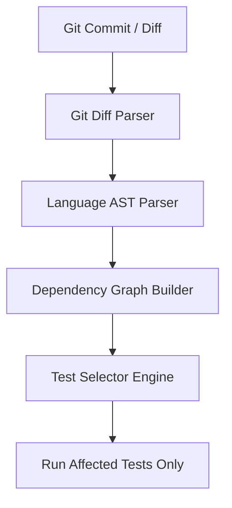

# Karma ⚡

> **Intelligent, Impact-Driven Test Selection for Accelerated CI/CD Pipelines**

[](https://www.python.org/)
[]()
[]()
[]()

---

## 📌 Overview

**Karma** is a smart test selection engine designed to drastically reduce CI/CD build times. Instead of executing an entire test suite on every code commit, Karma analyzes code diffs, builds dependency graphs, and intelligently runs **only the tests affected by your changes**.

By cutting out redundant test execution, Karma accelerates developer feedback loops, lowers cloud infrastructure costs, and optimizes software delivery.

---

## ✨ Key Features

- 🎯 **Git Diff Analysis**: Parses modified files and changed line ranges directly from git diffs.
- 🕸️ **AST & Dependency Mapping**: Constructs static dependency graphs connecting codebase modules to test suites.
- 🚀 **Selective Test Execution**: Filters out unaffected tests and executes only the required subset.
- 🧩 **Multi-Language Architecture**: Built with modular language parsers starting with Python support.
- ⚙️ **GitHub Actions Integration**: Native CI plugin with smart caching, PR summaries, and automatic pass/fail reporting.

---

## 🗺️ Project Roadmap & Phases

Karma is being developed across five distinct phases:

| Phase | Module / Target | Description | Status |
| :---: | :--- | :--- | :---: |
| **Phase 1** | **Git Diff & AST Analysis** | Analyze git diffs & build static code dependency graphs to select affected tests. | ✅ *Completed* |
| **Phase 2** | **GitHub Actions Integration** | Seamless CI runner plugins & GitHub Workflow integration. | ✅ *Completed* |
| **Phase 3** | **ML Prediction Layer** | AI/ML models to score test failure probabilities and prioritize high-risk tests. | 📅 *Planned* |
| **Phase 4** | **Flaky Test Registry** | Quarantine flaky tests, track failure reliability, and avoid false-positive pipeline breaks. | 📅 *Planned* |
| **Phase 5** | **LLM AI Copilot & Auto-Fix** | LLM-driven semantic test mapping, automated test generation, and failure diagnosis. | 📅 *Planned* |

---

## 🛠️ How It Works



1. **Diff Extraction**: Karma extracts modified files and line-level changes from the active git branch.
2. **Dependency Graph Construction**: The AST parser inspects imported modules and call chains to build a graph of affected code paths.
3. **Smart Selection**: Karma maps the changed dependencies against test files and generates an optimal subset of tests to execute.

---

## 📂 Repository Structure

```
Karma/
├── core/
│   ├── git_diff.py          # Git diff parser & change detection
│   ├── dep_graph.py         # Code & test dependency graph builder
│   ├── test_selector.py     # Test selection & filtering engine
│   ├── reporter.py          # CI result formatter & GitHub summary writer  [Phase 2]
│   └── cache.py             # AST dependency graph caching layer           [Phase 2]
├── languages/
│   └── python_parser.py     # Python AST code analyzer
├── tests/
│   ├── test_git_diff_parser.py
│   └── test_selector.py
├── action.yml               # GitHub Action manifest (Docker)              [Phase 2]
├── Dockerfile               # Container image for CI runner                [Phase 2]
├── entrypoint.sh            # Docker Action entrypoint                     [Phase 2]
├── cli.py                   # Command-line interface entrypoint
├── requirements.txt         # Package dependencies
├── .github/workflows/
│   └── karma-ci.yml         # Example / dogfood CI workflow                [Phase 2]
└── Readme.MD                # Project documentation
```

---

## 🚀 Quick Start

### Installation

1. **Clone the repository:**
   ```bash
   git clone https://github.com/Pradyuman-aviator/Karma.git
   cd Karma
   ```

2. **Install dependencies:**
   ```bash
   pip install -r requirements.txt
   ```

### Usage

Run Karma to analyze your branch changes and execute impacted tests:

```bash
karma run
```

Or invoke via Python CLI:

```bash
python cli.py run
```

Select affected tests without executing them:

```bash
python cli.py select --base main
```

---

## 🔗 CI Integration

Karma ships as a **Docker-based GitHub Action**. On every pull request or push, it diffs against the base branch, selects affected tests, runs them with pytest, and fails the job if any selected test fails.

### Reference workflow

See [`.github/workflows/karma-ci.yml`](.github/workflows/karma-ci.yml) for the dogfood workflow used in this repository.

### Use in any Python workflow

```yaml
name: CI

on:
  pull_request:
  push:
    branches: [main]

jobs:
  test:
    runs-on: ubuntu-latest
    steps:
      - uses: actions/checkout@v4
        with:
          fetch-depth: 0  # required for accurate base...HEAD diffs

      - name: Run Karma
        id: karma
        uses: Pradyuman-aviator/Karma@main   # or pin to a tag/SHA
        with:
          base-branch: ${{ github.event_name == 'pull_request' && format('origin/{0}', github.base_ref) || 'origin/main' }}

      - name: Affected tests
        run: echo "${{ steps.karma.outputs.test_files }}"
```

For a local checkout of this repo (dogfooding), use `uses: ./` instead of the remote ref.

### Inputs

| Input | Default | Description |
| --- | --- | --- |
| `base-branch` | `main` | Git ref to diff against (prefer `origin/<branch>` in CI) |

### Outputs

| Output | Description |
| --- | --- |
| `test_files` | Space-separated list of affected test files |
| `tests-run` | Number of affected test files executed |

### Exit behavior

- **0** — all affected tests passed, or none were affected
- **1** — one or more affected tests failed

### Notes

- Ensure `actions/checkout` uses `fetch-depth: 0` (or otherwise fetch the base ref) so `git diff` can see the merge base.
- Consumer application dependencies are not installed by the Action image. Install your project deps in a prior step if selected tests import your application packages.
- Dependency graphs are cached in `.karma_cache.json` in the workspace between rebuilds when source hashes match.

---

## 🤝 Contributing

Contributions are welcome! Feel free to open issues or submit pull requests to help advance Karma through its roadmap.

---

## 📜 License

Distributed under the [MIT License](LICENSE).

