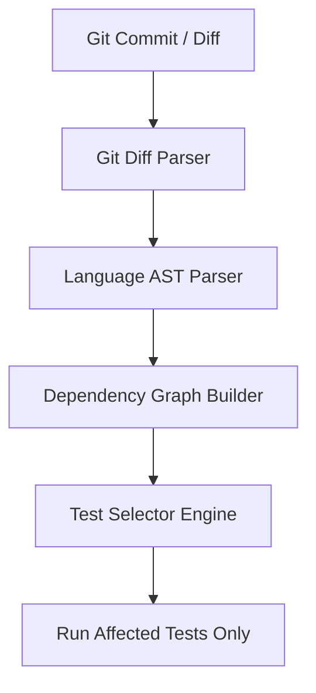

# Karma ⚡

> **Intelligent, Impact-Driven Test Selection for Accelerated CI/CD Pipelines**

[](https://www.python.org/)
[]()
[]()
[]()

---

## 📌 Overview

**Karma** is a smart test selection engine designed to drastically reduce CI/CD build times. Instead of executing an entire test suite on every code commit, Karma analyzes code diffs, builds dependency graphs, and intelligently runs **only the tests affected by your changes**.

By cutting out redundant test execution, Karma accelerates developer feedback loops, lowers cloud infrastructure costs, and optimizes software delivery.

---

## ✨ Key Features

- 🎯 **Git Diff Analysis**: Parses modified files and changed line ranges directly from git diffs.
- 🕸️ **AST & Dependency Mapping**: Constructs static dependency graphs connecting codebase modules to test suites.
- 🚀 **Selective Test Execution**: Filters out unaffected tests and executes only the required subset.
- 🧩 **Multi-Language Architecture**: Built with modular language parsers starting with Python support.

---

## 🗺️ Project Roadmap & Phases

Karma is being developed across four distinct phases:

| Phase | Module / Target | Description | Status |
| :---: | :--- | :--- | :---: |
| **Phase 1** | **Git Diff & AST Analysis** | Analyze git diffs & build static code dependency graphs to select affected tests. | ✅ *Completed* |
| **Phase 2** | **GitHub Actions Integration** | Seamless CI runner plugins & GitHub Workflow integration. | 📅 *Planned* |
| **Phase 3** | **ML Prediction Layer** | AI/ML models to score test failure probabilities and prioritize high-risk tests. | 📅 *Planned* |
| **Phase 4** | **Flaky Test Registry** | Quarantine flaky tests, track failure reliability, and avoid false-positive pipeline breaks. | 📅 *Planned* |

---

## 🛠️ How It Works



1. **Diff Extraction**: Karma extracts modified files and line-level changes from the active git branch.
2. **Dependency Graph Construction**: The AST parser inspects imported modules and call chains to build a graph of affected code paths.
3. **Smart Selection**: Karma maps the changed dependencies against test files and generates an optimal subset of tests to execute.

---

## 📂 Repository Structure

```
Karma/
├── core/
│   ├── git_diff.py          # Git diff parser & change detection
│   ├── dep_graph.py         # Code & test dependency graph builder
│   └── test_selector.py     # Test selection & filtering engine
├── languages/
│   └── python_parser.py     # Python AST code analyzer
├── tests/
│   ├── test_git_diff_parrser.py
│   └── test_selector.py
├── cli.py                   # Command-line interface entrypoint
├── requirements.txt         # Package dependencies
└── Readme.MD                # Project documentation
```

---

## 🚀 Quick Start

### Installation

1. **Clone the repository:**
   ```bash
   git clone https://github.com/Pradyuman-aviator/Karma.git
   cd Karma
   ```

2. **Install dependencies:**
   ```bash
   pip install -r requirements.txt
   ```

### Usage

Run Karma to analyze your branch changes and execute impacted tests:

```bash
karma run
```

Or invoke via Python CLI:

```bash
python cli.py run
```

---

## 🤝 Contributing

Contributions are welcome! Feel free to open issues or submit pull requests to help advance Karma through its roadmap.

---

## 📜 License

Distributed under the [MIT License](LICENSE).

