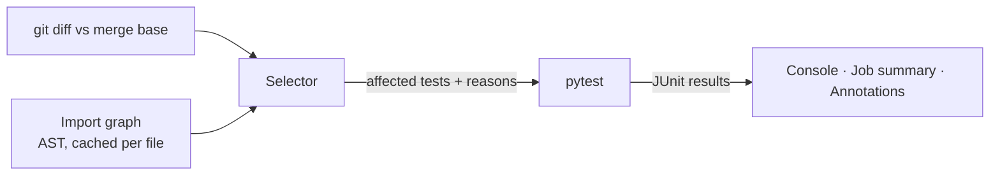

# Karma ⚡

> **Run only the tests your change can break.** Static, explainable test selection for pytest. No setup, no prior runs, no SaaS.

[](https://github.com/Pradyuman-aviator/Karma/actions/workflows/ci.yml)
[](https://www.python.org/)
[](LICENSE)
[](pyproject.toml)

```console
$ karma run --explain
karma: comparing the working tree against origin/main (merge base 3f9c2a1e04)
karma: 3 of 214 test files selected (98.6% skipped) for 2 changed files
tests/billing/test_invoice.py
    ← billing/invoice.py
    ← billing/tax.py  (changed)
tests/billing/test_tax.py
    ← billing/tax.py  (changed)
tests/test_settings.py
    ← settings.py  (changed)
......................                                                  [100%]
```

Karma reads your git diff, builds a dependency graph from your imports, and runs **only the tests that can be affected**. Every selected test comes with the chain of imports that selected it, so you can check its reasoning.

**Website:** [`docs/index.html`](docs/index.html) has the full tour: a playground on starlette's real dependency graph (or paste your own), a live demo of the risk model, interactive benchmarks, CI setup for GitHub Actions, GitLab, Jenkins, CircleCI and pre-commit, a savings calculator, a command explorer that builds any `karma` command, and a pitch mode for presenting. Its commands, Action inputs and configuration are generated from the source by `scripts/build_site.py`. To publish it, enable GitHub Pages in the repository settings (*Deploy from a branch* → `main`, `/docs`).

---

## Why Karma

| | Karma | Changed-files-only plugins<br>(e.g. pytest-picked) | Coverage-based<br>(e.g. pytest-testmon) | Test-selection SaaS | Build systems<br>(Bazel, Pants) |
| --- | :---: | :---: | :---: | :---: | :---: |
| Follows dependencies (edit `app.py` → run its tests) | ✅ | ❌ | ✅ | ✅ | ✅ |
| Works on the first run, no history or database | ✅ | ✅ | ❌ | ❌ | ✅ |
| No overhead while tests run | ✅ | ✅ | ❌ (tracing) | varies | ✅ |
| Data never leaves your machine | ✅ | ✅ | ✅ | ❌ | ✅ |
| Explains *why* each test was chosen | ✅ | ❌ | ❌ | partly | partly |
| Adopt without changing your build | ✅ | ✅ | ✅ | ✅ | ❌ |

**Honest trade-off:** Karma analyses code statically. It can't see an import built from a runtime string, or a data file a test reads, and coverage-based tools can. Karma's [safety net](#staying-safe) and [mappings](#configuration) cover these cases, and a periodic full run (`karma run --all`, e.g. nightly) closes the gap.

---

## Quick start

```bash
pip install git+https://github.com/Pradyuman-aviator/Karma.git
```

```bash
karma run                 # run tests affected by your branch + uncommitted work
karma run --explain       # ...and show why each test was selected
karma select              # just print them:  pytest $(karma select)
karma run -- -x -n auto   # everything after -- goes to pytest
```

Karma compares against the branch you'll merge into: `--base`, else `$KARMA_BASE`, else the pull request base on GitHub Actions, else `origin/HEAD`, else `main`/`master`.

### GitHub Actions

```yaml
jobs:
  test:
    runs-on: ubuntu-latest
    steps:
      - uses: actions/checkout@v5
        with:
          fetch-depth: 0            # optional, but saves Karma fetching history itself
      - uses: actions/setup-python@v6
        with:
          python-version: "3.13"
      - run: pip install -e ".[test]"   # your project and its test dependencies
      - uses: Pradyuman-aviator/Karma@main   # pin a tag or SHA in production
        with:
          args: --explain
```

The action runs in **your** job's Python environment, so selected tests can import your dependencies. On a pull request it:

- posts a **job summary** with pass/fail counts, "*N of M test files selected (X% skipped)*", collapsible failure output, and the reason for each selection
- adds **inline annotations** on the failing test lines
- exits with pytest's exit code, so the job fails exactly when a selected test fails

| Input | Default | Description |
| --- | --- | --- |
| `base-branch` | PR base / previous commit | Git ref to compare against |
| `command` | `run` | `run` or `select` (selection only) |
| `python` | `python` | Interpreter with pytest and your dependencies |
| `pytest-args` | | Extra pytest arguments, e.g. `-x -n auto` |
| `working-directory` | `.` | Project directory within the repository |
| `on-git-error` | `fail` | `run-all` runs the whole suite if changes can't be determined |
| `args` | | Extra Karma arguments, e.g. `--explain` |
| `prioritize` | `false` | `true` runs the tests most likely to fail first (see *Predict and prioritise*) |
| `retries` | `0` | Re-run failed tests up to N times; a pass on retry is reported as flaky, not a failure |
| `cache` | `true` | Keep `.karma_cache/` (import cache + test history) between runs with `actions/cache` |

| Output | Description |
| --- | --- |
| `test_files` | Space-separated selected test files |
| `tests-run` | Number of test files run |
| `selected-count` / `total-count` | Selected vs. total test files |
| `run-all` | `true` if a change triggered the full suite |
| `flaky-tests` | Node ids of tests that failed, then passed on retry |

### Pre-commit hook

```yaml
# .pre-commit-config.yaml
repos:
  - repo: local
    hooks:
      - id: karma
        name: affected tests
        entry: karma run --staged
        language: system
        pass_filenames: false
```

---

## How it works


```mermaid
graph LR
    A[git diff vs merge base] --> C[Selector]
    B[Import graph<br/>AST, cached per file] --> C
    C -->|affected tests + reasons| D[pytest]
    D -->|JUnit results| E[Console · Job summary · Annotations]
```

1. **What changed.** `git diff` from the *merge base* (exactly what your PR contains), plus uncommitted and untracked files when run locally. Deleted and renamed files are tracked.
2. **What depends on what.** Every Python file is parsed once and cached by content hash. The resolver handles:
   - absolute and relative imports, `from pkg import submodule`, and package `__init__` chains
   - `src/` layouts and namespace packages
   - pytest's sibling imports inside test directories
   - `importlib.import_module("…")` and `pytest_plugins`
   - files with syntax newer than your interpreter, via a fallback scan
3. **What to run.** A breadth-first search from each changed file through reverse dependencies. It also follows pytest's own rules:
   - a `conftest.py` or test-package `__init__.py` affects every test beneath it
   - plugins (`-p`, `PYTEST_PLUGINS`, `pytest11` entry points, `pytest_plugins`) affect every test
   - doctests: `test*.txt` files (or your `--doctest-glob`) are tests; their `>>>` imports are dependencies. With `--doctest-modules`, modules are tests and their docstring imports count too
   - `testpaths` and `norecursedirs` bound what counts as a test

   Karma reads these from pytest's own configuration, found the way pytest finds it: `pytest.toml`, `pytest.ini`, `pyproject.toml`, `tox.ini`, or `setup.cfg`, plus `addopts` and `PYTEST_ADDOPTS`.

### Staying safe

A test selector must never skip a test that would fail. Karma leans toward running more:

- Changes to packaging or pytest configuration (`pyproject.toml`, `setup.py`/`setup.cfg`, `tox.ini`, `pytest.ini`/`pytest.toml`), dependency files (`requirements*.txt`/`.in`, `requirements/*.txt`, `constraints*.txt`, lock files, `environment.yml`, `.python-version`), or a **git submodule** **run the whole suite**.
- A full run always goes to pytest's own discovery, so it can never "pass" with zero tests because Karma didn't recognise them.
- If git can't determine the changes (unknown ref, missing history), Karma **fails loudly** (exit 2) instead of passing with zero tests. `--on-git-error run-all` falls back to the full suite instead.
- Changed files that no test depends on are listed, so nothing is dropped silently.

### Validated on real projects

Real modules in two well-known open-source projects were deliberately broken, and Karma's selection was compared with the test files that *actually* failed when the full suite ran:

| Project | Modules broken | Failing test files Karma missed | Test files skipped (avg) |
| --- | ---: | ---: | ---: |
| [encode/starlette](https://github.com/encode/starlette) @ `9774b08` (1,277 tests) | 32 | **0** | 40.8%; 87–97% for leaf modules such as middleware |
| [Textualize/rich](https://github.com/Textualize/rich) @ `9d8f9a3` (1,007 tests) | 15 | **0** | 6.6% |

rich shows the limit of file-level analysis. Nearly every test imports `rich.console`, which imports most of the library, so most changes rightly select almost everything. Karma saves the most where components are separated, as in most applications and monorepos.

**Check it on your own project** before relying on it. The script mutates modules one at a time, runs your suite, and restores every file:

```bash
python scripts/safety_check.py --package src/yourpackage --samples 20
```

### Performance

The graph is cached per file by content hash, so a typical run re-parses only what changed. Cold starts parse in parallel across CPU cores. Measured on pandas' source tree (1,415 files, 8,140 import edges; Windows, 16 logical CPUs):

| | Time |
| --- | ---: |
| Cold, one process | 3.7 s |
| Cold, parallel | 1.2 s |
| Warm cache | 0.34 s |

Absolute timings vary with machine load: a later run of the same benchmark on a busier machine measured 4.4 s / 1.7 s / 0.8 s. The ratios hold: parallel parsing is about 3× faster than serial on a cold start, and the cache makes warm runs several times faster again.

---

## Predict and prioritise

Selection decides **which** tests run. Prioritisation decides **in what order**: the tests most likely to fail go first, so a broken change fails in the first seconds, not the last.

```console
$ karma run --prioritize --explain -- -x
karma: prioritised by risk using 214 recorded runs
tests/billing/test_invoice.py  (risk 71%: failed before when billing/tax.py changed; imports billing/tax.py (changed))
    ← billing/tax.py  (changed)
tests/test_settings.py  (risk 38%: the test itself changed)
    (changed)
tests/billing/test_report.py  (risk 9%: 2 imports away from billing/tax.py)
    ← billing/invoice.py
    ← billing/tax.py  (changed)
```

- **It never skips a test.** Every affected test still runs; only the order changes. Pair it with pytest's `-x` to stop at the first failure.
- **It learns from your history, locally.** Every `karma run` records each test file's outcome in `.karma_cache/history.jsonl`. Nothing is sent anywhere. In GitHub Actions, the Karma action keeps this directory between runs automatically (`cache: true`).
- **It's an explainable model, not a black box.** A logistic regression over seven features:
  - the test itself changed
  - distance from the change in imports
  - recent failure rate
  - how recently it last failed
  - failed before when these same files changed
  - flakiness
  - new test

  It trains online with no look-ahead (each past run is predicted only from the runs before it) and is regularised towards sensible priors, so it orders well from the very first run. Every score comes with its reasons.
- **Turn it on** with `--prioritize`, `prioritize = true` in `[tool.karma]`, or `prioritize: "true"` in the action.

`karma history` shows what the model sees: the most-failing tests, flaky candidates (outcome flips back and forth) and the slowest tests. `karma history --import report.xml ...` seeds the history from existing JUnit reports, so prioritisation is useful from day one.

### Measured

The 33 faults injected into [encode/starlette](https://github.com/encode/starlette) (see *Validated on real projects*) were replayed in random order, 20 times. Karma predicted each fault's ordering using only the faults before it. For the 24 faults whose selection allowed a choice of order:

| Ordering | Mean APFD | First failing test file found after |
| --- | ---: | ---: |
| Random | 0.785 | 5.04 files |
| Alphabetical (no prioritisation) | 0.840 | 3.50 files |
| Karma, priors only (no history) | 0.896 | 2.04 files |
| **Karma, learning from history** | 0.890 | **1.81 files** |

APFD (Average Percentage of Faults Detected, 1.0 = the first test finds the bug) is the standard measure in test-prioritisation research. Karma finds the first failure about **2× sooner** than alphabetical order and **2.8× sooner** than random.

Injected faults are independent of each other, so there is little to learn beyond the priors; real CI histories contain what the learned features are built for: fragile tests, recurring co-failures. Reproduce with `scripts/prioritization_benchmark.py`.

---

## Flaky tests

A flaky test fails a build that is fine, and trains people to ignore red. Karma detects flaky tests, isolates them, and notices when they are fixed, without ever hiding a real failure.

```console
$ karma run --retries 2
karma: retrying 1 failed test(s), attempt 1 of 2
  passed         214
  failed           0
  flaky            1
  FLAKY tests/net/test_client.py::test_timeout - passed on retry 1: TimeoutError
```

**Detect.** `--retries N` re-runs *only the failed tests*. A test that fails and then passes against the same code is **confirmed flaky**, which is far stronger evidence than a history of flip-flopping, since a real bug that got fixed flips too. A flaky test is reported as a warning and doesn't fail the build; use `--fail-on-flaky` for a strict policy. A test that fails every attempt is a real failure, and stays one.

**Quarantine.** `karma-quarantine.toml` is committed with your code and reviewed like it:

```toml
[[quarantine]]
id = "tests/net/test_client.py::test_timeout"
reason = "passed on retry after failing, in 3 recorded runs"
since = "2026-09-27"
issue = "https://github.com/acme/app/issues/123"
```

Quarantined tests **still run and are still reported**, but their failures don't fail the build. Skipping them would hide whether they have been fixed. An `id` can be a test, a test with any parameters, a class, or a whole file.

**Manage.**

| Command | Does |
| --- | --- |
| `karma flaky` | Quarantined tests with their recent results (`. . F .`), and confirmed flaky tests not yet quarantined |
| `karma flaky quarantine ID --reason ... --issue ...` | Quarantine a test |
| `karma flaky release ID` | Take it out of quarantine |
| `karma flaky sync` | Quarantine tests confirmed flaky in ≥2 runs; release those that passed their last 10 runs (`--dry-run` to preview) |

`karma flaky sync` is built to run as a scheduled CI job that opens a pull request, so the registry maintains itself and every change to it is reviewed.

**Stays out of the model.** Flaky and quarantined failures are recorded as such, so the risk model behind `--prioritize` doesn't learn noise as "this test finds bugs".

**Validated.** On starlette's full suite (1,277 tests) with `--retries 2`, the 14 tests that fail deterministically on Windows were retried, stayed failed, and none was misclassified as flaky.

---

## Configuration

Optional, in `pyproject.toml`:

```toml
[tool.karma]
test-patterns = ["test_*.py", "*_test.py"]  # default: pytest's python_files, else these
source-roots = [".", "src"]                  # where your top-level packages live
exclude = ["examples/*"]                     # never selected as tests (still analysed)
extend-run-all-on = ["Dockerfile"]           # add to the full-suite triggers (run-all-on replaces them)
pytest-args = ["-p", "no:cacheprovider"]     # always passed to pytest
prioritize = true                            # run the likeliest failures first

[tool.karma.mappings]                        # dependencies imports can't express
"tests/fixtures/*.json" = ["tests/test_loader.py"]
"app/templates/*" = ["app/render.py"]        # a module: its tests are selected too
```

Patterns without `/` match file names anywhere; patterns with `/` match the path from the project root. Unknown keys are rejected, so typos don't pass silently.

## CLI reference

| Command | |
| --- | --- |
| `karma run` | Select affected tests and run them with pytest |
| `karma select` | Print the selection: `--format text` (default, space-separated), `lines`, or `json` |
| `karma graph` | Print the dependency graph: `--format json`, `dot` (Graphviz), or `mermaid` |
| `karma history` | Most-failing, flaky and slowest tests from the recorded history; `--import` JUnit reports |
| `karma flaky` | The quarantine registry: `quarantine`, `release`, `sync` |

**What counts as changed** (`run` and `select`):

- `--base REF`, with `--head REF` to compare a commit instead of the working tree
- `--staged` for staged changes only
- `--files PATH…` to skip git entirely
- `--all` to select everything

**Other options:** `--explain`, `--prioritize`, `--retries N`, `--fail-on-flaky`, `--no-history` (run), `--ci` (GitHub outputs, summary and annotations), `--repo DIR`, `--python EXE`, `--jobs N`, `--no-cache`, `--on-git-error {fail,run-all}`, `-v`/`-q`.

**Exit codes:**

| Code | Meaning |
| --- | --- |
| pytest's | Returned as-is, except "no tests collected" (5) on a targeted run, which becomes 0 (a full run that collects nothing still fails) |
| 2 | Karma error: bad ref, invalid config, … |
| 130 | Interrupted |

---

## Roadmap

| Phase | Area | Status |
| :---: | --- | :---: |
| 1 | Git diff & AST dependency analysis | ✅ |
| 2 | GitHub Actions integration | ✅ |
| 3.0 | Hardening: merge-base diffs, conftest/safety-net selection, explainability, per-test reporting, incremental parallel cache | ✅ |
| 3 | ML prediction layer: predict failures from local history and run the likeliest first (`--prioritize`, `karma history`) | ✅ |
| 4 | Flaky-test registry: confirm flakiness with retries, quarantine in a reviewed registry, release healed tests (`--retries`, `karma flaky`) | ✅ |
| 5 | LLM copilot: semantic test mapping, failure diagnosis | 📅 |

## Contributing

See [CONTRIBUTING.md](CONTRIBUTING.md). In short: `pip install -e ".[dev]"`, then `pytest`, `ruff check .`, and `mypy` must all pass.

## License

[MIT](LICENSE)
