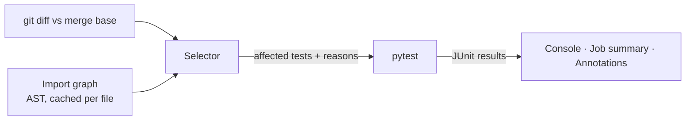

# Karma ⚡

> **Run only the tests your change can break.** Static, explainable test selection for pytest. No setup, no prior runs, no SaaS.

[](https://github.com/Pradyuman-aviator/Karma/actions/workflows/ci.yml)
[](https://www.python.org/)
[](LICENSE)
[](pyproject.toml)

```console
$ karma run --explain
karma: comparing the working tree against origin/main (merge base 3f9c2a1e04)
karma: 3 of 214 test files selected (98.6% skipped) for 2 changed files
tests/billing/test_invoice.py
    ← billing/invoice.py
    ← billing/tax.py  (changed)
tests/billing/test_tax.py
    ← billing/tax.py  (changed)
tests/test_settings.py
    ← settings.py  (changed)
......................                                                  [100%]
```

Karma reads your git diff, builds a dependency graph from your imports, and runs **only the tests that can be affected**. Every selected test comes with the chain of imports that selected it, so you can check its reasoning.

---

## Why Karma

| | Karma | Changed-files-only plugins<br>(e.g. pytest-picked) | Coverage-based<br>(e.g. pytest-testmon) | Test-selection SaaS | Build systems<br>(Bazel, Pants) |
| --- | :---: | :---: | :---: | :---: | :---: |
| Follows dependencies (edit `app.py` → run its tests) | ✅ | ❌ | ✅ | ✅ | ✅ |
| Works on the first run, no history or database | ✅ | ✅ | ❌ | ❌ | ✅ |
| No overhead while tests run | ✅ | ✅ | ❌ (tracing) | varies | ✅ |
| Data never leaves your machine | ✅ | ✅ | ✅ | ❌ | ✅ |
| Explains *why* each test was chosen | ✅ | ❌ | ❌ | partly | partly |
| Adopt without changing your build | ✅ | ✅ | ✅ | ✅ | ❌ |

**Honest trade-off:** Karma analyses code statically. It can't see an import built from a runtime string, or a data file a test reads, and coverage-based tools can. Karma's [safety net](#staying-safe) and [mappings](#configuration) cover these cases, and a periodic full run (`karma run --all`, e.g. nightly) closes the gap.

---

## Quick start

```bash
pip install git+https://github.com/Pradyuman-aviator/Karma.git
```

```bash
karma run                 # run tests affected by your branch + uncommitted work
karma run --explain       # ...and show why each test was selected
karma select              # just print them:  pytest $(karma select)
karma run -- -x -n auto   # everything after -- goes to pytest
```

Karma compares against the branch you'll merge into: `--base`, else `$KARMA_BASE`, else the pull request base on GitHub Actions, else `origin/HEAD`, else `main`/`master`.

### GitHub Actions

```yaml
jobs:
  test:
    runs-on: ubuntu-latest
    steps:
      - uses: actions/checkout@v5
        with:
          fetch-depth: 0            # optional, but saves Karma fetching history itself
      - uses: actions/setup-python@v6
        with:
          python-version: "3.13"
      - run: pip install -e ".[test]"   # your project and its test dependencies
      - uses: Pradyuman-aviator/Karma@main   # pin a tag or SHA in production
        with:
          args: --explain
```

The action runs in **your** job's Python environment, so selected tests can import your dependencies. On a pull request it:

- posts a **job summary** with pass/fail counts, "*N of M test files selected (X% skipped)*", collapsible failure output, and the reason for each selection
- adds **inline annotations** on the failing test lines
- exits with pytest's exit code, so the job fails exactly when a selected test fails

| Input | Default | Description |
| --- | --- | --- |
| `base-branch` | PR base / previous commit | Git ref to compare against |
| `command` | `run` | `run` or `select` (selection only) |
| `python` | `python` | Interpreter with pytest and your dependencies |
| `pytest-args` | | Extra pytest arguments, e.g. `-x -n auto` |
| `working-directory` | `.` | Project directory within the repository |
| `on-git-error` | `fail` | `run-all` runs the whole suite if changes can't be determined |
| `args` | | Extra Karma arguments, e.g. `--explain` |

| Output | Description |
| --- | --- |
| `test_files` | Space-separated selected test files |
| `tests-run` | Number of test files run |
| `selected-count` / `total-count` | Selected vs. total test files |
| `run-all` | `true` if a change triggered the full suite |

### Pre-commit hook

```yaml
# .pre-commit-config.yaml
repos:
  - repo: local
    hooks:
      - id: karma
        name: affected tests
        entry: karma run --staged
        language: system
        pass_filenames: false
```

---

## How it works


```mermaid
graph LR
    A[git diff vs merge base] --> C[Selector]
    B[Import graph<br/>AST, cached per file] --> C
    C -->|affected tests + reasons| D[pytest]
    D -->|JUnit results| E[Console · Job summary · Annotations]
```

1. **What changed.** `git diff` from the *merge base* (exactly what your PR contains), plus uncommitted and untracked files when run locally. Deleted and renamed files are tracked.
2. **What depends on what.** Every Python file is parsed once and cached by content hash. The resolver handles:
   - absolute and relative imports, `from pkg import submodule`, and package `__init__` chains
   - `src/` layouts and namespace packages
   - pytest's sibling imports inside test directories
   - `importlib.import_module("…")` and `pytest_plugins`
   - files with syntax newer than your interpreter, via a fallback scan
3. **What to run.** A breadth-first search from each changed file through reverse dependencies. It applies pytest's own rule that a `conftest.py` affects every test beneath it.

### Staying safe

A test selector must never skip a test that would fail. Karma leans toward running more:

- Changes to `pyproject.toml`, `setup.py`/`setup.cfg`, `tox.ini`, `pytest.ini`, `requirements*.txt`, `constraints*.txt`, or lock files **run the whole suite**.
- If git can't determine the changes (unknown ref, missing history), Karma **fails loudly** (exit 2) instead of passing with zero tests. `--on-git-error run-all` falls back to the full suite instead.
- Changed files that no test depends on are listed, so nothing is dropped silently.

### Validated on real projects

Real modules in two well-known open-source projects were deliberately broken, and Karma's selection was compared with the test files that *actually* failed when the full suite ran:

| Project | Modules broken | Failing test files Karma missed | Test files skipped (avg) |
| --- | ---: | ---: | ---: |
| [encode/starlette](https://github.com/encode/starlette) @ `9774b08` (1,277 tests) | 32 | **0** | 40.8%; 87–97% for leaf modules such as middleware |
| [Textualize/rich](https://github.com/Textualize/rich) @ `9d8f9a3` (1,007 tests) | 15 | **0** | 6.6% |

rich shows the limit of file-level analysis. Nearly every test imports `rich.console`, which imports most of the library, so most changes rightly select almost everything. Karma saves the most where components are separated, as in most applications and monorepos.

**Check it on your own project** before relying on it. The script mutates modules one at a time, runs your suite, and restores every file:

```bash
python scripts/safety_check.py --package src/yourpackage --samples 20
```

### Performance

The graph is cached per file by content hash, so a typical run re-parses only what changed. Cold starts parse in parallel across CPU cores. Measured on pandas' source tree (1,415 files, 8,140 import edges; Windows, 16 logical CPUs):

| | Time |
| --- | ---: |
| Cold, one process | 3.7 s |
| Cold, parallel | 1.2 s |
| Warm cache | 0.34 s |

---

## Configuration

Optional, in `pyproject.toml`:

```toml
[tool.karma]
test-patterns = ["test_*.py", "*_test.py"]  # default: pytest's python_files, else these
source-roots = [".", "src"]                  # where your top-level packages live
exclude = ["docs/*", "migrations/*"]         # never analysed
extend-run-all-on = ["Dockerfile"]           # add to the full-suite triggers (run-all-on replaces them)
pytest-args = ["-p", "no:cacheprovider"]     # always passed to pytest

[tool.karma.mappings]                        # dependencies imports can't express
"tests/fixtures/*.json" = ["tests/test_loader.py"]
"app/templates/*" = ["app/render.py"]        # a module: its tests are selected too
```

Patterns without `/` match file names anywhere; patterns with `/` match the path from the project root. Unknown keys are rejected, so typos don't pass silently.

## CLI reference

| Command | |
| --- | --- |
| `karma run` | Select affected tests and run them with pytest |
| `karma select` | Print the selection: `--format text` (default, space-separated), `lines`, or `json` |
| `karma graph` | Print the dependency graph: `--format json`, `dot` (Graphviz), or `mermaid` |

**What counts as changed** (`run` and `select`):

- `--base REF`, with `--head REF` to compare a commit instead of the working tree
- `--staged` for staged changes only
- `--files PATH…` to skip git entirely
- `--all` to select everything

**Other options:** `--explain`, `--ci` (GitHub outputs, summary and annotations), `--repo DIR`, `--python EXE`, `--jobs N`, `--no-cache`, `--on-git-error {fail,run-all}`, `-v`/`-q`.

**Exit codes:**

| Code | Meaning |
| --- | --- |
| pytest's | Returned as-is, except "no tests collected" (5), which becomes 0 |
| 2 | Karma error: bad ref, invalid config, … |
| 130 | Interrupted |

---

## Roadmap

| Phase | Area | Status |
| :---: | --- | :---: |
| 1 | Git diff & AST dependency analysis | ✅ |
| 2 | GitHub Actions integration | ✅ |
| 3.0 | Hardening: merge-base diffs, conftest/safety-net selection, explainability, per-test reporting, incremental parallel cache | ✅ |
| 3 | ML prediction layer: rank tests by failure likelihood, using the per-test results Karma now records | 📅 |
| 4 | Flaky-test registry: quarantine and track unreliable tests | 📅 |
| 5 | LLM copilot: semantic test mapping, failure diagnosis | 📅 |

## Contributing

See [CONTRIBUTING.md](CONTRIBUTING.md). In short: `pip install -e ".[dev]"`, then `pytest`, `ruff check .`, and `mypy` must all pass.

## License

[MIT](LICENSE)
